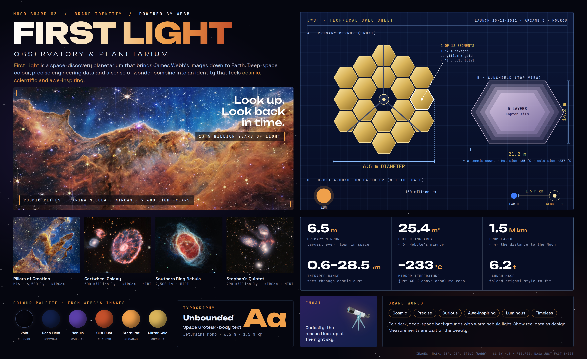

# Mood Board 03: First Light Observatory & Planetarium

A dark, data-driven brand board themed on galaxies and the James Webb Space Telescope.

- **Colour:** Void, Deep Field, Nebula, Cliff Rust, Starburst, Mirror Gold (sampled from Webb images)
- **Fonts:** Unbounded (display), Space Grotesk (body), JetBrains Mono (data)
- **Images:** Cosmic Cliffs, Pillars of Creation, Cartwheel Galaxy, Southern Ring Nebula, Stephan's Quintet
- **Emoji:** 🔭, standing for curiosity
- **JWST measurements:** 6.5 m mirror (18 × 1.32 m segments), 25.4 m² collecting area, 21.2 × 14.2 m five-layer sunshield,
  1.5 million km to L2, 0.6–28.5 µm infrared range, ≈40 K mirror temperature, 6.2 t launch mass, launched 25 Dec 2021.

Images: NASA, ESA, CSA, STScI (Webb), CC BY 4.0. Fonts: SIL Open Font License.
